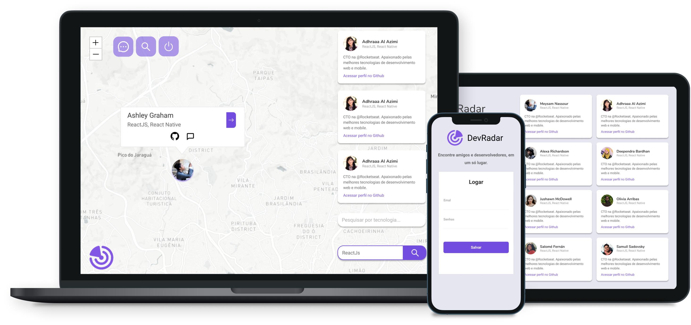

<h1 align="center">
  
</h1>

<h4 align="center">
  🚧 In progress 🚧
</h4>

    <a href="#-project">Project</a>&nbsp;&nbsp;&nbsp;|&nbsp;&nbsp;&nbsp;
    <a href="#-technologies">Technologies</a>&nbsp;&nbsp;&nbsp;|&nbsp;&nbsp;&nbsp;
    <a href="#-run">Run</a>&nbsp;&nbsp;&nbsp;

 

  

## 💻 Project

DevRadar is a social media with the main objective: connect developers, promote discussions about technologies, share projects and solve issues with people who are already on that environment.

## 👨🏼‍💻 Technologies

#### Backend

- [x] NodeJS;
- [x] Prisma;
- [x] Postgresql;
- [x] Typescript;
- [x] Express;
- [x] Nodemailer;

#### Frontend

- [x] ReactJS;
- [x] Typescript;
- [x] NextJS;
- [x] Styled-Components;
- [x] Leaflet;

## ⛷ Run

- Clone the repository with `git clone https://github.com/Gabriel-J3sus/gabrieljesus.com.git`
- Install all dependencies with `yarn`;
- Navigate to the backend folder and run: `yarn prisma migration generate` (you need postgresql configured and .env file updated);
- In the same folder, run: `yarn dev`;
- In another terminal, navigate to the web folder;
- Run `yarn dev` and everything will work correctly.
